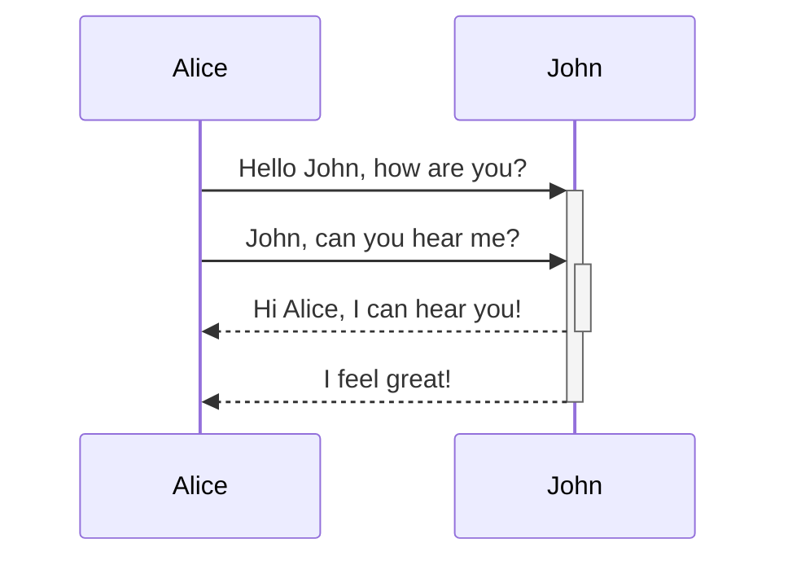
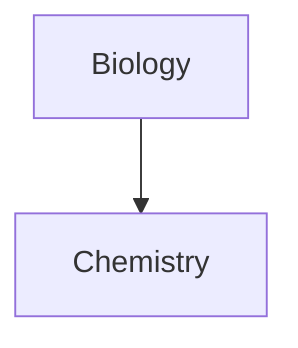

## **Tables**

| **First Name** | **Last Name** |
| ---------- | --------- |
| *Max*        | Planck    |
| Marie      | Curie     |

### **Cell Alignment**

Left-aligned text | Center-aligned text | Right-aligned text
:-- | :--: | --:
Content | Content | Content

## **Mermaid Diagrams**

## **Math using MathJax**

$$ 
\begin{vmatrix}a & b\\ 
c & d 
\end{vmatrix}=ad-bc 
$$

### **Inline Math**

This is an inline math expression $e^{2i\pi} = 1$.

%% This is not working either. %%
